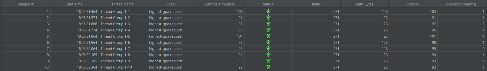

# Exercise-profiling

---
Nama    : Muhammad Naufal Ramadhan  
NPM     : 2306241700  
Kelas   : B  

---

## Test Results

---
### getAllStudentWithCourse

### getAllStudentWithCourse Optimized

---

### joinStudentNames

### joinStudentNames Optimized

---

### findStudentWithHighestGpa

### findStudentWithHighestGpa Optimized

---

### Results (sample time comparison)
1) getAllStudentWithCourse 
   - Before : 95192ms
   - After  : 18347ms  
     <b>Approx 81% Improvement</b>
2) joinStudentNames
    - Before : 2582ms
    - After  : 206ms  
    <b>Approx 92% Improvement</b>
3) findStudentWithHighestGpa
    - Before : 101ms
    - After  : 12ms  
    <b>Approx 88% Improvement</b>

---

## Reflection

1. What is the difference between the approach of performance testing with JMeter and profiling with IntelliJ Profiler in the context of optimizing application performance?
2. How does the profiling process help you in identifying and understanding the weak points in your application?
3. Do you think IntelliJ Profiler is effective in assisting you to analyze and identify bottlenecks in your application code?
4. What are the main challenges you face when conducting performance testing and profiling, and how do you overcome these challenges?
5. What are the main benefits you gain from using IntelliJ Profiler for profiling your application code?
6. How do you handle situations where the results from profiling with IntelliJ Profiler are not entirely consistent with findings from performance testing using JMeter?
7. What strategies do you implement in optimizing application code after analyzing results from performance testing and profiling? How do you ensure the changes you make do not affect the application's functionality?

---

## Jawaban

1. Dari pengamatan saya, JMeter lebih berfokus pada simulasi beban pengguna dan menghitung waktu respons API, untuk mengidentifikasi bottleneck dari sisi client. Sedangkan IntelliJ Profiler mengukur dan menganalisa performa dari sisi backend, seperti pada exercise ini menunjukkan method apa yang menggunakan CPU dan memory apa yang paling banyak. Sehingga kesimpulannya, JMeter melihat delay dari sisi client/pengguna, sedangkan IntelliJ Profiler menganalisa waktu eksekusi dan resource consumption dari sisi backend.
2. Dengan menggunakan profiling, dan dilakukan testing untuk setiap API saya bisa melihat detail setiap method terkait menggunakan resource dan waktu eksekusinya. Sehingga saya bisa melihat dan menganalisa dari profiling tersebut method apa yang kurang efisien dan perlu di refactor.
3. Iya menurut saya sangat efektif. tidak seperti JMeter yang intinya mengukur delay dari suatu API. pada IntelliJ Profiler selain mengukur waktu, saya bisa melihat detail dan mengetahui jelas konsumsi resource setiap method.
4. Untuk pertama kali, saya mengalami kesulitan untuk mencerna hasil dari profiling nya. Seperti pada Flame Graph, saya agak bingung apa arti bar nya lebih kebawah dibanding yang lain atau lebih lebar dari yang lain, dan kenapa ada beberapa saat total konsumsi yang ditampilkan tidak 100% dari parent, dan fitur Timeline yang diisi banyak informasi yang tidak saya familiar, seperti method-methodnya yang ditampilkan. Kemudian terjadinya inkonsistensi dengan hasil sebelumnya atau dengan JMeter, Untuk mengatasi kendala yang ada saya perlu mempelajari lebih tentang hasil profiling dari IntelliJ Profiling ini, kemudian terkait hasil testing yang inkonsisten, saya lakukan repeating testing dan dilakukan di lingkungan testing yang lebih terkontrol. 
5. Benefit utama dari menggunakan profiler adalah dalam identifikasi bottleneck dan optimisasi performa di sisi backend. Dengan mengukur konsumsi CPU dan memori dapat membantu saya dalam mengidentifikasi proses atau method yang boros dan kurang efisien, sehingga bisa saya refactor. 
6. Karena IntelliJ Profiler menganalisa dari sisi backend dan JMeter dari sisi client, jika terdapat inkonsistensi, bisa jadi karena faktor eksternal seperti latensi jaringan atau antrian request. Langkah saya selanjutnya adalah melakukan testing di environment yang lebih terkontrol semisal localhost, dan saya dapat memastikan pengaruhnya yang bukan dari faktor eksternal, seperti query database yang lambat.
7. Dalam mengoptimalkan kode aplikasi, strategi nya setelah menganalisa hasil profiling adalah mengidentifikasi bottlenect utama atau kode yang tidak efisien dan menerapkan solusi yang sesuai tanpa merusak fungsionalitas, seperti pada contoh sebelumnya adalah menghilangkan bagian yang tidak perlu dengan menggunakan loop dan langsung return semua objectnya pada method getAllStudentWithCourse. Kemudian untuk memastikan bahwa perubahan/solusi yang telah diterapkan tidak merusak fungsionalitas aplikasi adalah dengan menerapkan automated testing, karena di intellij mudah melakukan testing bisa langsung terlihat jika terdapat error atau output yang tidak sesuai.